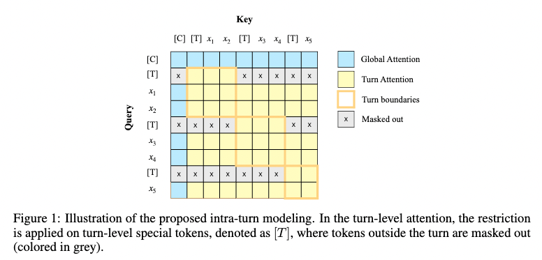

# HiDialog 
**Hierarchical Dialogue Understanding with Special Tokens and Turn-level Attention, ICLR 2023, Tiny Papers** \
\
This is the official code repository of our ICLR 2023 Tiny paper. In this paper, we proposed a *simple but effective* **Hi**erarchical **Dialog**ue Understanding model, **HiDialog**. we first insert multiple special tokens into a dialogue and propose the turn-level attention to learn turn embeddings hierarchically. Then, a heterogeneous graph module is leveraged to polish the learned embeddings. 



# Requirements
Our experiments are conducted with following core packages:
- PyTorch 1.11.0
- CUDA 11.6
- dgl-cuda11.3 0.8.2    
- sklearn

# Experiments
To reproduce our training process in main experiments on **DialogRE**, 
- download [RoBERTa](https://github.com/pytorch/fairseq/tree/main/examples/roberta) and unzip it to ```pre-trained_model/RoBERTa/```.
- download ```merges.txt``` and ```vocab.json``` from [here](https://huggingface.co/roberta-large/tree/main), put them to ```pre-trained_model/RoBERTa/```
- download [DialogRE](https://github.com/nlpdata/dialogre) 
- copy the *.json files into datasets/DialogRE
- run ```bash dialogre.sh``` 

\
To reproduce our training process in main experiments on **MELD**, 
- download [RoBERTa](https://github.com/pytorch/fairseq/tree/main/examples/roberta) and unzip it to ```pre-trained_model/RoBERTa/```.
- download ```merges.txt``` and ```vocab.json``` from [here](https://huggingface.co/roberta-large/tree/main), put them to ```pre-trained_model/RoBERTa/```
- download [MELD](https://github.com/declare-lab/MELD)
- copy the *.json files into datasets/MELD 
- run ```python MELD.py```
- run ```bash meld.sh```