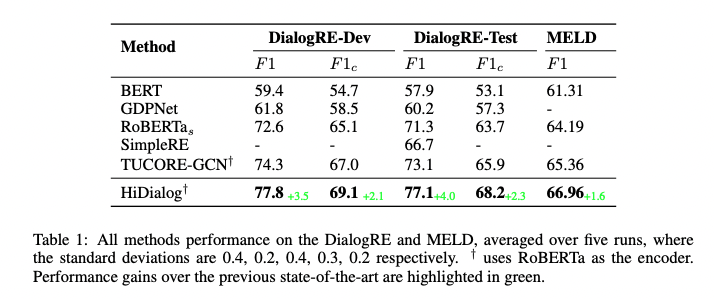

# HiDialog 
**Hierarchical Dialogue Understanding with Special Tokens and Turn-level Attention, ICLR 2023, Tiny Papers**

https://arxiv.org/abs/2305.00262

\
This is the official code repository of our ICLR 2023 Tiny paper. In this paper, we proposed a *simple but effective* **Hi**erarchical **Dialog**ue Understanding model, **HiDialog**. we first insert multiple special tokens into a dialogue and propose the turn-level attention to learn turn embeddings hierarchically. Then, a heterogeneous graph module is leveraged to polish the learned embeddings. 


# Requirements
Our experiments are conducted with following core packages:
- PyTorch 1.11.0
- CUDA 11.6
- dgl-cuda11.3 0.8.2    
- sklearn


# Experiments
**Main Results**



**Reproducibility**

To reproduce our training process in main experiments on **DialogRE**, 
- download [RoBERTa](https://github.com/pytorch/fairseq/tree/main/examples/roberta) and unzip it to ```pre-trained_model/RoBERTa/```.
- download  ```config.json```, ```merges.txt``` and ```vocab.json``` from [here](https://huggingface.co/roberta-large/tree/main), put them to ```pre-trained_model/RoBERTa/```
- download [DialogRE](https://github.com/nlpdata/dialogre) 
- copy the *.json files into datasets/DialogRE
- run ```bash dialogre.sh``` 

\
To reproduce our training process in main experiments on **MELD**, 
- download [RoBERTa](https://github.com/pytorch/fairseq/tree/main/examples/roberta) and unzip it to ```pre-trained_model/RoBERTa/```.
- download ```config.json```, ```merges.txt``` and ```vocab.json``` from [here](https://huggingface.co/roberta-large/tree/main), put them to ```pre-trained_model/RoBERTa/```
- download [MELD](https://github.com/declare-lab/MELD)
- copy the *.json files into datasets/MELD 
- run ```python MELD.py```
- run ```bash meld.sh```

## Credits
This project is expanded upon from a course project at NUS [[Course Page](https://knmnyn.github.io/cs4248-2120/)].
The code repository is based on following projects:
- ACL-20, "Dialogue-Based Relation Extraction" [[github](https://github.com/nlpdata/dialogre)]
- AAAI-21, "GDPNet: Refining Refining Latent Multi-View Graph for Relation Extraction" [[github](https://github.com/XueFuzhao/GDPNet)]
- EMNLP-21, "Graph Based Network with Contextualized Representations of Turns in Dialogue" [[github](https://github.com/BlackNoodle/TUCORE-GCN)]

Thanks for their amazing work.

## Reference 
```
@Article{liu2023hierarchical,
  author  = {Xiao Liu and Jian Zhang and Heng Zhang and Fuzhao Xue and Yang You},
  title   = {Hierarchical Dialogue Understanding with Special Tokens and Turn-level Attention},
  journal = {arXiv preprint arXiv:2305.00262},
  year    = {2023},
}
```
